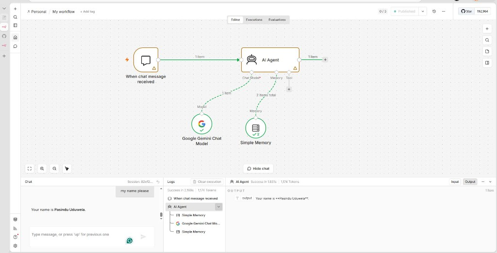
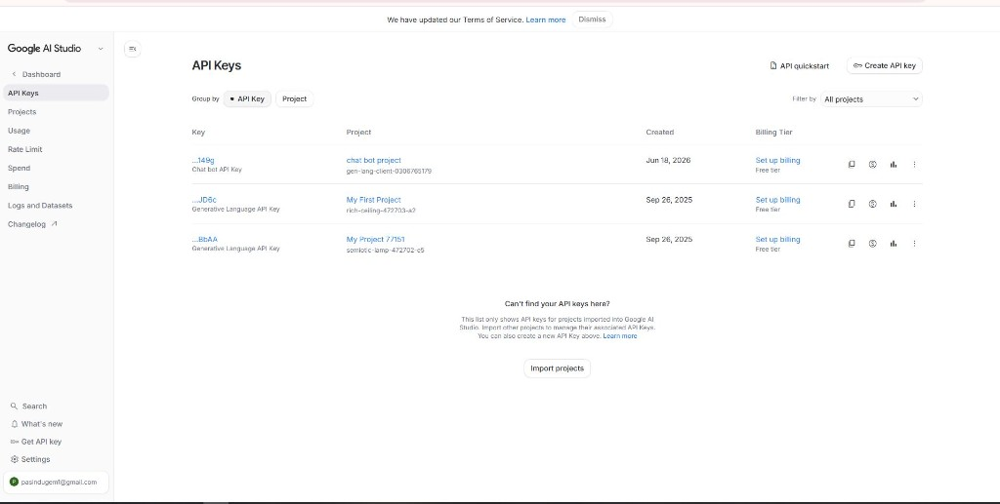
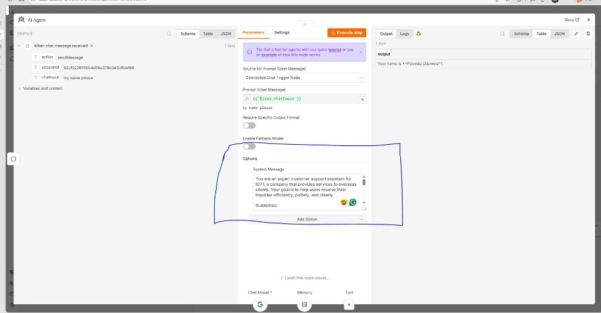
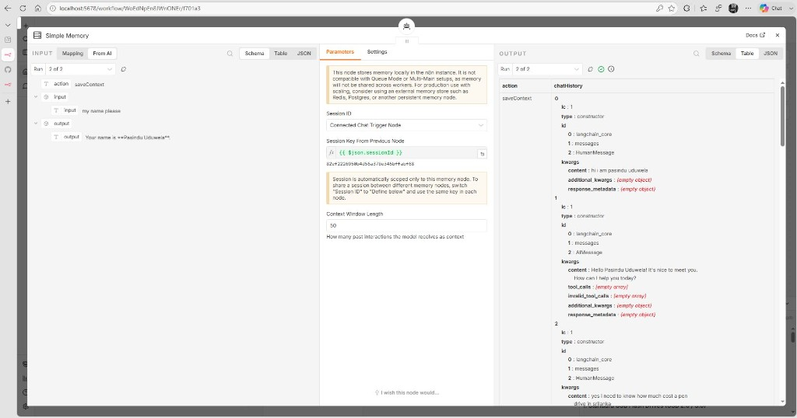
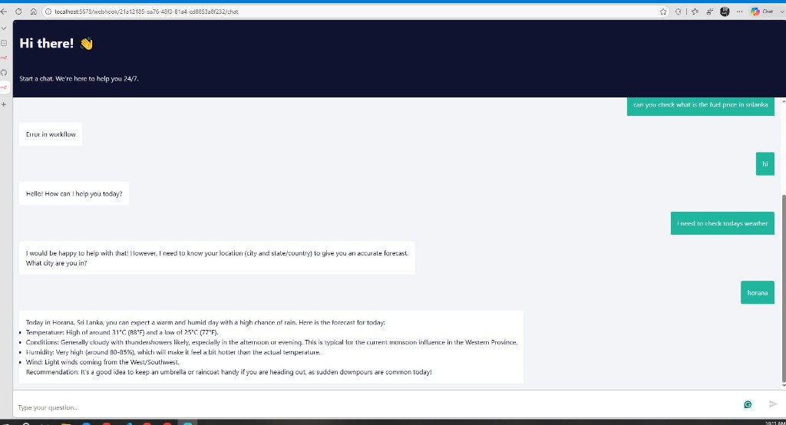

# N8N Chat Bot Agent

A simple AI chatbot built with [n8n](https://n8n.io), powered by Google Gemini. This project runs n8n locally via Docker and documents how to configure the workflow nodes so the bot can chat with users, remember context, and respond in a consistent support-assistant tone.

## Quick Start

1. Copy the environment file and start n8n:

   ```powershell
   .\scripts\n8n-up.ps1
   ```

2. Open n8n at [http://localhost:5678](http://localhost:5678).

3. Create or import the chatbot workflow (see [Workflow Overview](#workflow-overview) below).

4. Add your Google Gemini API key, publish the workflow, and open the chat URL.

## Workflow Overview

The chatbot workflow connects four main pieces: a chat trigger, an AI Agent, a Gemini language model, and conversation memory.



| Node | Role |
|------|------|
| **When chat message received** | Entry point. Starts the workflow when a user sends a message through the built-in chat UI or webhook. |
| **AI Agent** | Orchestrates the conversation. It receives the user message, loads chat history from memory, sends the prompt to Gemini, and returns the reply. |
| **Google Gemini Chat Model** | Provides the LLM (large language model) that generates natural-language responses. |
| **Simple Memory** | Stores past messages so the bot can remember context within a session (for example, the user's name). |

**Why this structure is needed:** The trigger alone cannot think or remember. The Gemini node supplies intelligence, Simple Memory supplies context across messages, and the AI Agent ties them together into one conversational flow.

---

## Configuration Guide

### 1. Google Gemini API Key

Before the bot can respond, n8n needs a valid API key to call Google's Gemini models.



**Steps:**

1. Go to [Google AI Studio](https://aistudio.google.com/apikey).
2. Click **Create API key** and choose or create a Google Cloud project.
3. Copy the key and paste it into the **Google Gemini Chat Model** node credentials in n8n.

**Why this is needed:**

- **Authentication** — Google rejects requests without a valid API key.
- **Project tracking** — Each key is tied to a project so you can monitor usage and limits.
- **Billing** — The free tier is enough for development and testing. For higher rate limits or production traffic, you may need to set up billing on the project.

**Security:** Treat the API key like a password. Store it in n8n credentials or environment variables. Never commit it to Git.

---

### 2. AI Agent — System Message & Prompt

The AI Agent node defines how the bot behaves and what message it responds to.



#### System Message

Example:

> You are an expert customer support assistant for IGT1, a company that provides services to overseas clients. Your goal is to help users resolve their inquiries efficiently, politely, and clearly.

**Why this is needed:** The system message sets the bot's **persona, tone, and goals**. Without it, Gemini would answer generically. With it, every reply stays aligned with your brand and support style.

#### Prompt (User Message)

| Setting | Value | Why |
|---------|-------|-----|
| **Source for Prompt** | Connected Chat Trigger Node | Tells the agent to read the user's message from the chat trigger, not a hardcoded string. |
| **Prompt** | `{{ $json.chatInput }}` | Passes the actual text the user typed (e.g. `"my name please"`) into the model. |

**Why dynamic prompting is needed:** Each chat message is different. The expression `{{ $json.chatInput }}` maps the incoming `chatInput` field from the trigger into the agent so it responds to the current message, not a fixed prompt.

#### Other options (shown in the screenshot)

- **Require Specific Output Format** — Off by default. Turn on only if you need structured output (JSON, etc.).
- **Enable Fallback Model** — Off by default. Turn on if you want a backup model when the primary one fails.

---

### 3. Simple Memory

Memory lets the bot recall earlier messages in the same conversation (for example, remembering that the user's name is Pasindu after they introduced themselves).



| Setting | Value | Why it is needed |
|---------|-------|------------------|
| **Session ID** | Connected Chat Trigger Node | Links memory to the chat session automatically. Each browser session gets a unique `sessionId`. |
| **Session Key From Previous Node** | `{{ $json.sessionId }}` | Scopes memory to one conversation. User A's history stays separate from User B's. |
| **Context Window Length** | `50` | Limits how many past messages are sent to the model. Keeps responses relevant and controls token usage/cost. |

**How it works:** When a user says *"hi i am pasindu uduwela"*, memory saves that exchange. Later, when they ask *"my name please"*, the agent can read the history and answer correctly.

**Local storage warning:** Simple Memory stores data inside the n8n instance. It works well for local development and single-instance setups. For production with multiple workers or queue mode, use an external store (Redis, Postgres, etc.) so memory is shared across instances.

---

### 4. Chat Interface (After Publish)

Once the workflow is **published** (active), n8n serves a built-in chat UI at a webhook URL.



**Example URL:**

```
http://localhost:5678/webhook/<your-webhook-id>/chat
```

| Part | Meaning |
|------|---------|
| `localhost:5678` | Your n8n instance (matches `N8N_PORT` in `.env`). |
| `/webhook/` | Base path for webhook triggers. |
| `<your-webhook-id>` | Unique ID assigned to this workflow's Chat Trigger node. |
| `/chat` | Serves the graphical chat UI (not just a raw API endpoint). |

**Why `/chat` matters:** Without the `/chat` suffix you get the API endpoint only. Adding `/chat` gives users the ready-made chat window with message bubbles and an input field.

**Tips:**

- Keep the workflow **active** (published) or the URL will not respond.
- If you see **"Error in workflow"**, check that the Gemini API key is set and all nodes are configured correctly.
- For public access, set `WEBHOOK_URL` in `.env` to your public hostname before starting n8n.

---

## Environment Variables

Copy `.env.example` to `.env` and adjust as needed:

| Variable | Default | Purpose |
|----------|---------|---------|
| `N8N_PORT` | `5678` | Port n8n listens on. |
| `N8N_HOST` | `localhost` | Hostname n8n reports. |
| `N8N_PROTOCOL` | `http` | `http` or `https`. |
| `WEBHOOK_URL` | `http://localhost:5678/` | Base URL used for webhook/chat links. |
| `GENERIC_TIMEZONE` | `America/New_York` | Timezone for workflow scheduling. |
| `TZ` | `America/New_York` | Container timezone. |

## Scripts

| Script | Description |
|--------|-------------|
| `.\scripts\n8n-up.ps1` | Pull latest image and start n8n |
| `.\scripts\n8n-down.ps1` | Stop n8n |
| `.\scripts\n8n-logs.ps1` | View container logs |
| `.\scripts\n8n-update.ps1` | Update to the latest n8n image |

## Data Persistence

Workflow data, credentials, and Simple Memory are stored in `./n8n-data` (mounted into the Docker container). Back up this folder if you want to keep your workflows and chat history across reinstalls.

## License

See [LICENSE](LICENSE).
